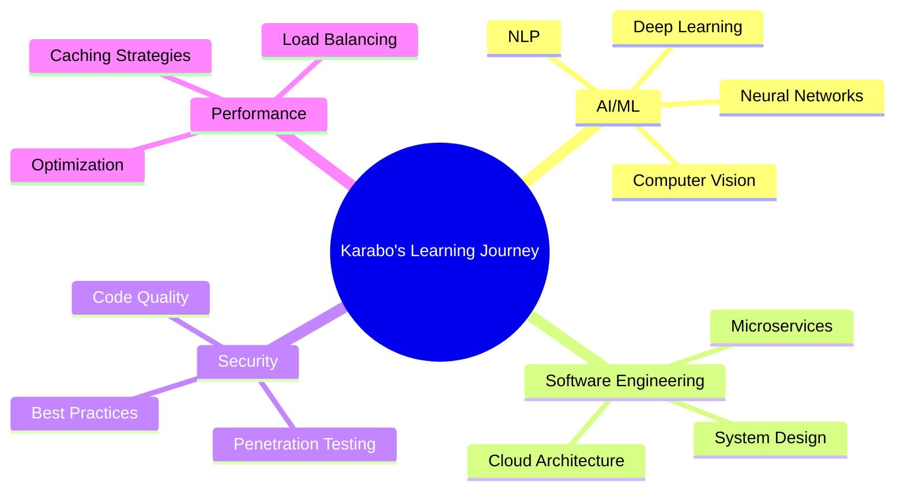

# 👋 Hi there, I'm Karabo Oliphant

  
  
  

---

## 🚀 About Me

Passionate **Software Engineer** and **Full-Stack Developer** from **South Africa 🇿🇦**, dedicated to building modern, scalable web applications and exploring the exciting world of **Artificial Intelligence** and **Machine Learning**.

- 💼 **Role:** Software Engineer & Full-Stack Web Developer
- 🎯 **Current Focus:** AI/ML, System Architecture, Cloud Solutions
- 🌱 **Learning:** Advanced Neural Networks, Software Security, Performance Optimization
- ☕ **Fun Fact:** I turn coffee into code!
- � **Motto:** *Always learning, always building, always growing*

---

## 💻 Tech Stack

### 🎨 Frontend Development

### ⚙️ Backend Development

### ☁️ Cloud & DevOps

### 🔧 APIs & Tools

---

## 🎓 Education & Certifications

<table>
<tr>
<td width="50%">

### 🎓 Stanford University (Online)
**Machine Learning & Artificial Intelligence**  
📅 2025-2026  
🧠 Advanced ML algorithms, Neural Networks, Deep Learning

</td>
<td width="50%">

### 📚 DynamicDNA
**System Development Level 4**  
📅 2025-2026  
💼 Enterprise Software Development, System Architecture

</td>
</tr>
<tr>
<td colspan="2">

### ✅ ALX Africa
**Software Engineering Certificate**  
📅 2024  
🚀 Full-Stack Development, Algorithms, Data Structures

</td>
</tr>
</table>

---

## 📊 GitHub Statistics

---

## 🏆 GitHub Trophies

---

## 🌱 Currently Learning

---

## 📈 Contribution Activity

---

## 💡 Quote of the Day

---

### 🤝 Let's Connect and Build Something Amazing Together!

---

**💡 "Always learning, always building, always growing"**

