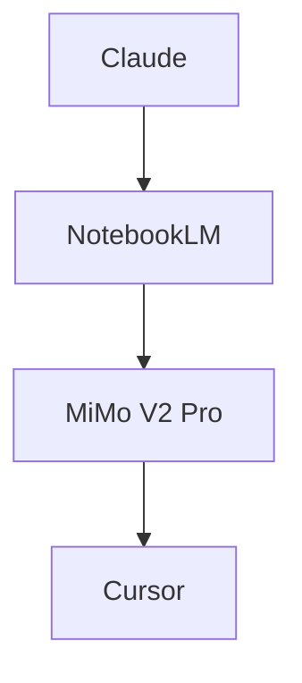

# My AI-Assisted Development Workflow

> A 4-layer system for building applications efficiently without writing code yourself.
> Built through trial and error. Optimised for token efficiency, context persistence, and clean output.

---

## The Core Philosophy

Most people one-shot projects — paste a vague idea into an LLM and hope for the best.
This workflow treats LLMs as **mechanical execution tools**, not oracles.
Each layer has one job. Nothing overlaps. The system compounds over time.

---

## The Stack

| Layer | Tool | Job |
|-------|------|-----|
| 1 | Claude | Architecture & planning |
| 2 | NotebookLM | Persistent project brain |
| 3 | MiMo V2 Pro | Code writing |
| 4 | Cursor | Environment — run, test, git |

---
## Overview Diagram



### Tool Logos

| Tool | Logo |
|---|---|
| Claude | <svg width="40" height="40" viewBox="0 0 40 40" xmlns="http://www.w3.org/2000/svg"><rect x="3" y="3" width="34" height="34" rx="8" fill="#F59E0B"/><circle cx="20" cy="20" r="10" fill="#111827" opacity="0.15"/><text x="20" y="25" text-anchor="middle" font-family="Arial, sans-serif" font-size="16" fill="#ffffff">C</text></svg> |
| NotebookLM | <svg width="40" height="40" viewBox="0 0 40 40" xmlns="http://www.w3.org/2000/svg"><rect x="3" y="3" width="34" height="34" rx="8" fill="#22C55E"/><circle cx="20" cy="20" r="10" fill="#111827" opacity="0.15"/><text x="20" y="25" text-anchor="middle" font-family="Arial, sans-serif" font-size="14" fill="#ffffff">NL</text></svg> |
| MiMo V2 Pro | <svg width="40" height="40" viewBox="0 0 40 40" xmlns="http://www.w3.org/2000/svg"><rect x="3" y="3" width="34" height="34" rx="8" fill="#3B82F6"/><path d="M14 12h12l-2 6h-8l-2 6h8l-2 6H14l2-6H8l2-6h4l-2-6z" fill="#ffffff" opacity="0.18"/><text x="20" y="25" text-anchor="middle" font-family="Arial, sans-serif" font-size="14" fill="#ffffff">M2</text></svg> |
| Cursor | <svg width="40" height="40" viewBox="0 0 40 40" xmlns="http://www.w3.org/2000/svg"><rect x="3" y="3" width="34" height="34" rx="8" fill="#111827"/><path d="M14 14l12 6-12 6V14z" fill="#22C55E"/><text x="26" y="25" text-anchor="middle" font-family="Arial, sans-serif" font-size="12" fill="#ffffff">CS</text></svg> |

---

## Layer 1 — Claude (Architecture)

**When:** Once per project, or at the start of every major feature.

**What happens here:**
- Define the system architecture
- Plan the tech stack
- Think through business logic, edge cases, and constraints
- Identify what the system must and must not do

**Output:** A structured architecture document — the source of truth for everything downstream.

**Key rule:** This is the thinking layer. Claude does the heavy reasoning here so no other layer has to.

### Rationale
This layer exists to lock the “why” and the constraints early, so later layers can execute without re-litigating decisions.
It prevents common failure modes:
- Design drift across sessions/features (the architecture becomes a stable reference point)
- Hidden assumptions (non-goals and constraints are stated explicitly up front)
- Rework caused by unclear interfaces (downstream layers know what inputs/outputs and invariants to target)

---

## Layer 2 — NotebookLM (The Brain)

**When:** After architecture is defined. Active throughout the entire project.

**What happens here:**
- Upload the architecture document
- Have deep conversations about the system to internalise the logic
- Draft structured prompts for the coding layer using this template:

```
TASK:        [What needs to be built — 2-3 sentences max]
STACK:       [Relevant technologies and frameworks]
CONSTRAINTS: [What not to do / patterns to follow]
CONTEXT:     [Only what's directly relevant to this task]
DONE WHEN:   [Clear, specific acceptance criteria]
```

**Output:** A structured, prescriptive prompt — not too long, not too short. No ambiguity for the LLM to fill in itself.

**Key rule:** NotebookLM holds the project context so the coding LLM doesn't have to reason about it. The reasoning has already been done here.

### Rationale
This layer exists to turn “architecture intent” into a task-ready contract that the coding model can execute reliably.
It reduces execution risk by:
- Eliminating vagueness: prompts include `TASK`, `STACK`, `CONSTRAINTS`, `CONTEXT`, and measurable `DONE WHEN`
- Ensuring the coder uses the right context: NotebookLM retrieves relevant project facts instead of relying on memory guesses
- Minimizing token waste: only task-relevant information is forwarded downstream
- Creating a durable reference for debugging: when failures happen, you compare outputs to the contract rather than restarting reasoning from scratch

---

## Layer 3 — MiMo V2  (Code Writer)

**When:** During active coding sessions, fed directly by NotebookLM's structured prompt.

**What happens here:**
- Receives a structured brief — not an essay, not a vague one-liner
- Implements code based on clear, prescriptive instructions
- Operates in **non-reasoning mode** — the reasoning was done upstream in Claude and NotebookLM
- Only switches to reasoning mode when debugging complex or unexpected failures

**Why MiMo V2 :**
- Ranks #1 open-source globally on SWE-Bench Verified and SWE-Bench Multilingual
- Trained on 100,000+ verifiable GitHub issues — built to execute well-defined coding tasks
- Generates at 150 tokens/second — fast feedback loop
- 256K context window — handles large codebases and long briefs without truncation
- MIT licensed — commercially permissible

**Key rule:** This layer is purely mechanical execution. The spec is clear, the context is loaded, MiMo just writes. No gap-filling. No hallucinating business logic. The upstream layers have already done the thinking.

### Rationale
This layer exists to convert the brief into code without letting the model “think past the spec”.
It keeps execution stable by:
- Reducing model freedom: it follows prescriptive instructions instead of inventing business logic
- Containing reasoning costs: reasoning is only used when debugging truly ambiguous failures
- Producing outputs that are easier to test quickly against `DONE WHEN`
- Maintaining separation of concerns so upstream layers remain the single source of design truth

---

## Layer 4 — Cursor (Environment)

**When:** After code is generated.

**What happens here:**
- Paste and run generated code
- Test functionality
- Handle git commits and version control
- Minor terminal and git fixes only — no AI-assisted coding here

**Key rule:** Cursor is the environment, not the brain. AI stays out of this layer except for small, isolated fixes.

### Rationale
This layer exists to verify that the proposed code actually works in your real project environment.
It keeps the workflow from “LLM success, engineering failure” by:
- Grounding changes in tests and runtime checks (so mistakes are caught immediately)
- Containing risk (you review/execute; the model doesn’t silently decide correctness)
- Preserving engineering hygiene (git commits, small diffs, and repeatable runs)
- Enforcing a clean loop: generate code, run/test, then iterate with the brief updated

---

## The Full Flow

```
Claude
  └── Architecture doc
        └── NotebookLM
              └── Structured prompt (TASK / STACK / CONSTRAINTS / CONTEXT / DONE WHEN)
                    └── MiMo V2 Pro (non-reasoning mode)
                          └── Clean code output
                                └── Cursor (run + test + git)
```

---

## Why This Works

**Token efficiency** — Each LLM only sees what's relevant to its job. No wasted context, no hitting limits mid-project.

**No gap-filling** — The structured prompt format means the coding LLM receives unambiguous instructions. It doesn't need to make assumptions.

**Compounds over time** — NotebookLM’s evolving spec and prompt history keep decisions consistent across sessions. By session 20, the coding layer is operating with weeks of accumulated project knowledge.

**Cost control** — Non-reasoning mode over reasoning mode. The reasoning happens upstream in Claude and NotebookLM. MiMo only executes — no reasoning tokens wasted.

**Separation of concerns** — If something breaks, you know exactly which layer failed. Architecture wrong? Layer 1. Spec unclear? Layer 2. Bad code? Layer 3. Execution/runtime issues? Layer 4.

**The right tool for the right job** — MiMo V2 Pro is purpose-built for agentic coding workflows. It doesn't need to reason about what to build — it just needs a clear spec. That's exactly what this workflow provides.

---

*Built through months of trial and error. The frustration was the curriculum.*
