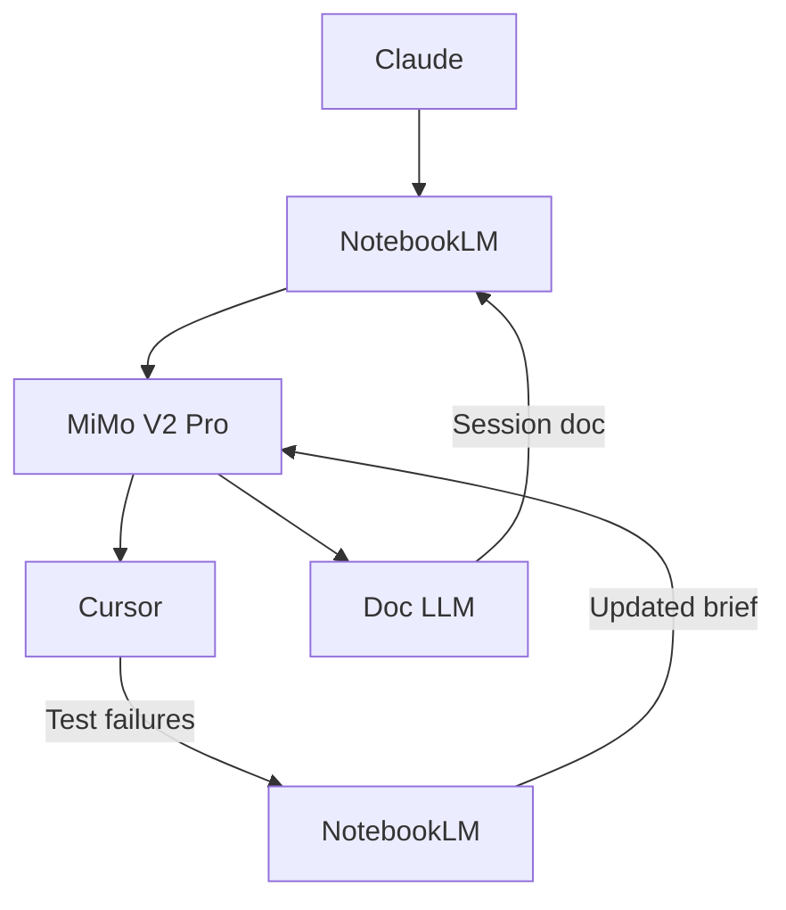

# My AI-Assisted Development Workflow

> A 4-layer system for building applications efficiently without writing code yourself.
> Built through trial and error. Optimised for token efficiency, context persistence, and clean output.

---

## The Core Philosophy

Most people one-shot projects — paste a vague idea into an LLM and hope for the best.
This workflow treats LLMs as **mechanical execution tools**, not oracles.
Each layer has one job. Nothing overlaps. The system compounds over time.

---

## The Stack

| Layer | Tool | Job |
|-------|------|-----|
| 1 | Claude | Architecture & planning |
| 2 | NotebookLM | Persistent project brain |
| 3 | MiMo V2 Pro | Code writing |
| 4 | Cursor | Environment — run, test, git |
| 5 | Doc LLM | Parallel documentation agent |

---

## Overview Diagram



---

## Layer 0 — Standards Suite (Before Any Code)

**When:** Once per project, before Claude touches any architecture.

**What happens here:**

Claude drafts a full standards suite — not just the architecture, but the engineering culture of the project. These documents become the immovable rules that every layer operates within.

```
/docs
  architecture.md       ← system design, components, flow
  stack.md              ← tech choices + why
  tradeoffs.md          ← what you ruled out + reasons
  coding-standards.md   ← naming, structure, patterns, what's banned
  infra-standards.md    ← environments, deployment, config rules
  decision-log.md       ← every major call + rationale
```

**What coding-standards.md covers:**
- Folder and file naming conventions
- Error handling patterns
- Allowed and banned abstractions
- How environment variables are named
- Code style rules (no magic numbers, etc.)

**Key rule:** These docs are the constitution. No layer is allowed to contradict them. They get uploaded to NotebookLM as the first and most important sources.

### Rationale
Most projects drift over time because standards were never written down. By locking them in Layer 0, every MiMo brief that NotebookLM produces will automatically enforce them — without you having to remember them session to session.

---

## Layer 1 — Claude (Architecture)

**When:** Once per project, or at the start of every major feature.

**What happens here:**
- Define the system architecture
- Plan the tech stack
- Think through business logic, edge cases, and constraints
- Identify what the system must and must not do

**Output:** A structured architecture document — the source of truth for everything downstream.

**Key rule:** This is the thinking layer. Claude does the heavy reasoning here so no other layer has to.

### Rationale
This layer exists to lock the "why" and the constraints early, so later layers can execute without re-litigating decisions.
It prevents common failure modes:
- Design drift across sessions/features (the architecture becomes a stable reference point)
- Hidden assumptions (non-goals and constraints are stated explicitly up front)
- Rework caused by unclear interfaces (downstream layers know what inputs/outputs and invariants to target)

---

## Layer 2 — NotebookLM (The Brain)

**When:** After architecture is defined. Active throughout the entire project.

**What happens here:**
- Upload the full standards suite (Layer 0 docs) first
- Upload the architecture document
- Have deep conversations about the system to internalise the logic
- Draft structured prompts for the coding layer using this template:

```
TASK:        [What needs to be built — 2-3 sentences max]
STACK:       [Relevant technologies and frameworks]
CONSTRAINTS: [What not to do / patterns to follow — pulled from coding-standards.md]
CONTEXT:     [Only what's directly relevant to this task]
DONE WHEN:   [Clear, specific acceptance criteria]
```

**How to supercharge prompts with standards:**
When asking NotebookLM to draft a brief, instruct it explicitly:

> "Draft this brief strictly within the constraints of our coding-standards.md and infra-standards.md. Any pattern that violates those docs should appear as a CONSTRAINT."

Now every brief NotebookLM produces is automatically filtered through your engineering culture — MiMo never receives a prompt that contradicts your standards.

**Output:** A structured, prescriptive prompt — not too long, not too short. No ambiguity for the LLM to fill in itself.

**Key rule:** NotebookLM holds the project context so the coding LLM doesn't have to reason about it. The reasoning has already been done here. Crucially — it holds both what was *planned* (architecture docs) and what was *actually built* (session docs from the Doc LLM). This keeps the brain aligned with reality.

### Rationale
This layer exists to turn "architecture intent" into a task-ready contract that the coding model can execute reliably.
It reduces execution risk by:
- Eliminating vagueness: prompts include `TASK`, `STACK`, `CONSTRAINTS`, `CONTEXT`, and measurable `DONE WHEN`
- Ensuring the coder uses the right context: NotebookLM retrieves relevant project facts instead of relying on memory guesses
- Minimizing token waste: only task-relevant information is forwarded downstream
- Creating a durable reference for debugging: when failures happen, you compare outputs to the contract rather than restarting reasoning from scratch
- Enforcing standards automatically: every brief is generated against the same engineering constitution

---

## Layer 3 — MiMo V2 Pro (Code Writer)

**When:** During active coding sessions, fed directly by NotebookLM's structured prompt.

**What happens here:**
- Receives a structured brief — not an essay, not a vague one-liner
- Implements code based on clear, prescriptive instructions
- Operates in **non-reasoning mode** — the reasoning was done upstream in Claude and NotebookLM
- Only switches to reasoning mode when debugging complex or unexpected failures

**Why MiMo V2 Pro:**
- Ranks #1 open-source globally on SWE-Bench Verified and SWE-Bench Multilingual
- Trained on 100,000+ verifiable GitHub issues — built to execute well-defined coding tasks
- Generates at 150 tokens/second — fast feedback loop
- 256K context window — handles large codebases and long briefs without truncation
- MIT licensed — commercially permissible
- Pro tier (700M credits / $50/mo) provides headroom for scale without ever hitting a wall mid-session

**Key rule:** This layer is purely mechanical execution. The spec is clear, the context is loaded, MiMo just writes. No gap-filling. No hallucinating business logic. The upstream layers have already done the thinking.

### Rationale
This layer exists to convert the brief into code without letting the model "think past the spec".
It keeps execution stable by:
- Reducing model freedom: it follows prescriptive instructions instead of inventing business logic
- Containing reasoning costs: reasoning is only used when debugging truly ambiguous failures
- Producing outputs that are easier to test quickly against `DONE WHEN`
- Maintaining separation of concerns so upstream layers remain the single source of design truth

---

## Layer 4 — Cursor (Environment)

**When:** After code is generated.

**What happens here:**
- Paste and run generated code
- Test functionality
- Handle git commits and version control
- Minor terminal and git fixes only — no AI-assisted coding here
- Capture and format test failures for the feedback loop

**Failure capture format:**
When tests fail, format the output before sending it upstream:

```
FAILED:   [test name]
EXPECTED: [x]
GOT:      [y]
FILE:     [location]
```

**Key rule:** Cursor is the environment, not the brain. AI stays out of this layer except for small, isolated fixes.

### Rationale
This layer exists to verify that the proposed code actually works in your real project environment.
It keeps the workflow from "LLM success, engineering failure" by:
- Grounding changes in tests and runtime checks (so mistakes are caught immediately)
- Containing risk (you review/execute; the model doesn't silently decide correctness)
- Preserving engineering hygiene (git commits, small diffs, and repeatable runs)
- Enforcing a clean loop: generate code, run/test, then iterate with the brief updated

---

## Layer 5 — Doc LLM (Parallel Documentation Agent)

**When:** Running in parallel with MiMo during every active coding session.

**What happens here:**

A cheap, fast model (e.g. Claude Haiku, Gemini Flash) runs in a second terminal alongside MiMo. It doesn't code — it watches and documents. After each implementation, it receives:

- The diff / what changed
- The brief MiMo was working from
- Test results from Cursor

And it produces a structured session doc:

```
CHANGED:        [what was implemented]
WHY:            [linked back to the brief]
PATTERN USED:   [e.g. repository pattern, error boundary]
FILES AFFECTED: [list]
KNOWN GAPS:     [anything incomplete or flagged]
```

At the end of each session, this doc is uploaded to NotebookLM.

**Key rule:** The Doc LLM is an observer, not a decision-maker. It documents reality — what actually got built — so NotebookLM's brain always reflects the true state of the project, not just the plan.

### Rationale
NotebookLM's weakness without this layer is that it only knows what you manually tell it. The Doc LLM closes that gap automatically. Over time, NotebookLM holds both the architecture intent AND the implementation reality — and can surface drift between the two before it becomes a problem.

---

## The Semi-Autonomous Feedback Loop

**When:** A test fails in Cursor.

This is where the workflow becomes self-healing. Instead of manually debugging and re-prompting, failures feed directly back into the system:

```
Cursor runs tests
  └── Failure captured and formatted
        └── Fed into NotebookLM as new source
              └── NotebookLM updates the brief
                    (failure becomes new CONSTRAINT, DONE WHEN is refined)
                        └── MiMo re-executes against updated brief
                              └── Back to Cursor
```

**The human gate:** You sit between NotebookLM's updated brief and MiMo's re-execution. You review the updated brief, approve it, send it. This keeps the loop semi-autonomous — not fully autonomous. That's intentional. The loop is self-healing, but you stay in control of what gets executed.

**Why this works:**
- Failures don't interrupt flow — they become new constraints in the spec
- NotebookLM contextualises the failure against the full system (not just the isolated error)
- MiMo receives an updated brief that already accounts for what went wrong
- The decision-log.md can be updated with what the failure revealed

---

## The Full Flow

```
Claude (standards suite + architecture)
  └── /docs uploaded to NotebookLM
        └── NotebookLM (brain)
              └── Structured prompt (TASK / STACK / CONSTRAINTS / CONTEXT / DONE WHEN)
                    ├── MiMo V2 Pro — Terminal 1 (executes code)
                    │     └── Cursor (run + test + git)
                    │           └── [on failure] → NotebookLM → updated brief → MiMo
                    └── Doc LLM — Terminal 2 (documents in parallel)
                          └── Session doc → NotebookLM (brain stays current)
```

---

## Why This Works

**Token efficiency** — Each LLM only sees what's relevant to its job. No wasted context, no hitting limits mid-project.

**No gap-filling** — The structured prompt format means the coding LLM receives unambiguous instructions. It doesn't need to make assumptions.

**Standards-enforced consistency** — Every brief is generated against the same engineering constitution. Six months in, the codebase looks like one person wrote it.

**Compounds over time** — NotebookLM's evolving spec, session docs, and prompt history keep decisions consistent across sessions. By session 20, the coding layer is operating with weeks of accumulated project knowledge — both planned and actually built.

**Cost control** — Non-reasoning mode over reasoning mode. The reasoning happens upstream in Claude and NotebookLM. MiMo only executes — no reasoning tokens wasted. The Doc LLM is cheap by design.

**Self-healing loop** — Test failures don't break flow. They feed back into the system as new constraints, and MiMo re-executes against a tighter spec.

**Separation of concerns** — If something breaks, you know exactly which layer failed. Architecture wrong? Layer 1. Spec unclear? Layer 2. Bad code? Layer 3. Execution/runtime issues? Layer 4. Documentation gap? Layer 5.

**The right tool for the right job** — MiMo V2 Pro is purpose-built for agentic coding workflows. It doesn't need to reason about what to build — it just needs a clear spec. That's exactly what this workflow provides.

---

*Built through months of trial and error. The frustration was the curriculum.*
